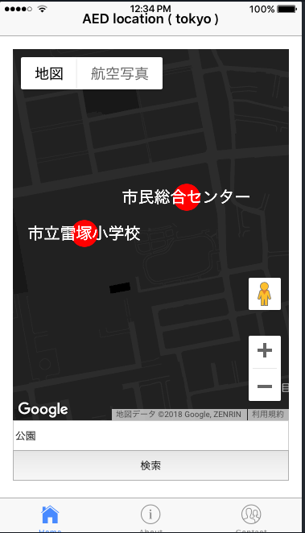
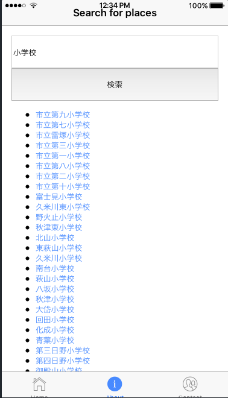

## Ionicを使ってHybridアプリを作る。

Ionicのtutorialをやったのでそのまとめ。
[Tutorial](https://ionicframework.com/docs/)


編集中で随時、改変加えてます。(2018/10/06)

[Pythonしか書かない人用JavaScriptとの違いまとめ](https://sayazamurai.github.io/python-vs-javascript/)

#### ハイブリッドアプリってどういう立ち位置？

* ウェブアプリ:

Webブラウザを介して機能するアプリケーションの総称をウェブアプリ。処理はWebサーバーで行われます。

* ネイティブアプリ:

AndroidアプリやiOSアプリなどスマートフォンやタブレットでダウンロードして使うアプリケーション。Webサーバーを介さなくても起動することが出来て処理は端末内の演算装置で行う。

* ハイブリッドアプリ:

ウェブアプリとネイティブアプリの中間。ネイティブアプリの上でWebサイト、Webアプリを動かすイメージ？オフラインでは動作しない。

[参考][ウェブアプリとネイティブアプリの違い｜抑えておくべき7つの項目](https://appbu.jp/webapps-nativeapps)

#### Installation

nodeのインストール：
```
$ brew install node
```
cordova,ionic,ios-sim
```
$ sudo npm install -g ionic cordova
$ sudo npm install -g ionic
$ sudo npm install -g ios-sim
```

#### 取り敢えず動かす
Ionicプロジェクを作成
```
$ ionic start {your project name} tabs
$ cd {your project name}
```
tabsの部分はテンプレートを指定する

* tabs :
* sidemenu :
* blank :
* super : 

#### 実行
1. エミュレータを用いて起動
Ionicに対象プラットフォームを追加 (iOS/Android)
```
$ ionic cordova platform add ios
\\$ ionic cordova platform rm ios
```
ビルド、エミュレータ起動

```
$ ionic cordova build ios
$ ionic cordova emulate ios --target "iPhone-7"
```

（これでは動かなかったので2の方法を利用）

2. ブラウザ起動
```
$ ionic serve
```
もしくは
```
$ ionic serve --lab
```

アプリで起動

コンソールを起動したまま、同じWi-Fiに繋げる。
[Ionic DevApp - Ionic Pro Documentation](https://ionicframework.com/docs/pro/devapp/)

#### Hands on

tabs/tabs.htmlに各タブのHTMLファイルが指定されている。\[root\]に場所がある。"tab1Root"はtabs/tabs.tsにて記載されている。

```html:tabs/tabs.html
<ion-tabs>
  <ion-tab [root]="tab1Root" tabTitle="Home" tabIcon="home"></ion-tab>
  <ion-tab [root]="tab2Root" tabTitle="About" tabIcon="information-circle"></ion-tab>
  <ion-tab [root]="tab3Root" tabTitle="Contact" tabIcon="contacts"></ion-tab>
</ion-tabs>
```

```JavaScript:tabs/tabs.ts
export class TabsPage {

  tab1Root = HomePage;
  tab2Root = AboutPage;
  tab3Root = ContactPage;

  constructor() {

  }
}
```

##### homeタブ(一番最初の画面)のテキストを書き換える。

```html:home/home.html
...
<ion-content padding>
  <h2>Welcome to Ionic App tokawa ! </h2>
  <p>
    This starter project comes with simple tabs-based layout for apps
    that are going to primarily use a Tabbed UI.
  </p>
...
</ion-content>
```

タグ内のテキストを書き換えると反映される。

##### JavaScriptを動かす

index.htmlはアプリの出発点。スクリプト、boostrap、CSSをセットアップしてアプリをlaunchする。簡単なScriptを動かす。以下のコードをindex.htmlの\<head\>タグに書き込む。
* 余談：

jsファイルを読み込む位置に関しては\<head\>内と\<body\>内があり、\<head\>で読み込むとjs->htmlと\<body\>内だとhtml->jsと表示される。大きいjsの場合\<body\>で読み込むとスムーズ。

```html:index.html
<script type="text/javascript">
  console.log("Hello");
</script>
```

##### マップを表示させる。

以下をindex.htmlにコピペするとマップが表示される。

[参考][Simple Map  |  Maps JavaScript API  |  Google Developers](https://developers.google.com/maps/documentation/javascript/examples/map-simple)

```html:index.html
...
<script src="https://maps.googleapis.com/maps/api/js?key=YOUR_API_KEY&callback=initMap"async defer></script>
...
```
のYOUR_API_KEYを取得するか、削除して動かす。

2018年6月11日より、料金体系が変更。APIのキーを取得するのが面倒に。。。

###### コード解説
[参考][Overview  |  Maps JavaScript API  |  Google Developers](https://developers.google.com/maps/documentation/javascript/tutorial)
1. We declare the application as HTML5 using the <!DOCTYPE html> declaration.
2. We create a div element named "map" to hold the map.
3. We define a JavaScript function that creates a map in the div.
4. We load the Maps JavaScript API using a script tag.

```html
<style>
  /* Always set the map height explicitly to define the size of the div
   * element that contains the map. */
  #map {
    height: 100%;
  }
  /* Optional: Makes the sample page fill the window. */
  html, body {
    height: 100%;
    margin: 0;
    padding: 0;
  }
</style>

```
#map :　idがmapのオブジェクトのサイズ
html,body : ウィンドウ全体のサイズ

```html
<body>
    <div id="map"></div>
    <script>
      var map;
      function initMap() {
        map = new google.maps.Map(document.getElementById('map'), {
          center: {lat: -34.397, lng: 150.644},
          zoom: 8
        });
      }
    </script>
    <script src="https://maps.googleapis.com/maps/api/js?key=YOUR_API_KEY&callback=initMap"
    async defer></script>
  </body>
```
idがmapのdivタグを作成し、scriptでmapにobjectを代入している。
asyncで非同期処理。APIをロードしている間にhtmlを読み込む。

#### マーカーを表示させる

initMap()の中の内容を変更するだけ

```javascript
 var myLatLng = {lat: -25.363, lng: 131.044};

        var map = new google.maps.Map(document.getElementById('map'), {
          zoom: 4,
          center: myLatLng
        });

        var marker = new google.maps.Marker({
          position: myLatLng,
          map: map,
          title: 'Hello World!'
```

#### 複数のマーカーを表示させる

```javascript
function initMap() {

  var position_data = [{lat: 35.681167,lng: 139.767052,name:"Tokoyo"},{lat:35.684801, lng:139.766086, name: "Otemachi"}]

  var map = new google.maps.Map(document.getElementById('map'), {
    zoom: 14,
    center: position_data[0]
  });

  var markers = [];

  for(i = 0;i < position_data.length;i++){
    markers[i] = new google.maps.Marker({
      position: position_data[i],
      map: map,
      title: 'Hello World!'
    });
  }

```

#### マップのデザイン改良

Styling wizardでデザインを作ってmapのstylesにJSONを貼り付ける。

[参考][Styling Wizard: Google Maps APIs](https://mapstyle.withgoogle.com/)

[参考][Google Maps APIs Styling Wizard を使って カスタマイズしたマップを使う ｜ Tips Note by TAM](https://www.tam-tam.co.jp/tipsnote/html_css/post14880.html)

#### サーバー環境の構築
[参考][[Vagrant based development environment for WordPress]](http://vccw.cc/)
作成したアプリがデータベースと連携してデータを動的に変更できるようにする。WordPressが動くサーバーの構築を行う。

##### はじめに
参考リンクを参考に
```
vagrant up
```
でブラウザ上からVagrantにアクセス可能な状態に。

##### 詳細設定（任意）
```
cp provision/default.yml site.yml
```
サイトの詳細設定を行うため、provision/default.ymlをvccwにコピーしsite.ymlに名前を変更する。
```
hostname: vccw.dev
```
を
```
hostname: {your_name}.local
```
に変更。(これによりyour_name.localでサイトにアクセス可能に)


IPアドレスの取得を仮想マシン自動に行うため
```
config.vm.hostname = _conf['hostname']
config.vm.network :private_network, ip: _conf['ip']
```

を

```
config.vm.hostname = _conf['hostname']
  config.vm.network :public_network, type: 'dhcp', bridge: 'en1: Wi-Fi (AirPort)'

  config.hostmanager.enabled = true
  config.hostmanager.manage_host = true
  config.hostmanager.ip_resolver = proc do |vm, resolving_vm|
    ip_address = ''
    if hostname = (vm.ssh_info && vm.ssh_info[:host])
      vm.communicate.execute("/sbin/ifconfig enp0s8 | grep 'inet addr' | tail -n 1 | egrep -o '[0-9\.]+' | head -n 1 2>&1") do |type, contents|
        ip_address = contents.split("\n").first
      end
    end
    ip_address
  end
```

に、変更。

##### 注意点

仮想マシンの電源を落としておかないと次回起動した際にエラーになることがある。
なので、終わるときは

```
vagrant halt
```

でマシンを落としておく事。
それでも、エラーが出る場合はVirtualBoxを起動して手動でマシンの削除を行うと良い。

#### WordPressのカスタマイズ

管理者ページにログイン

URL : http://{hostname}/wp-admin/

ID : admin

pass : admin

カスタムフィールドテンプレートをインストール

plugins -> add new -> "custom field template"
-> add new -> activate

練習としてオープンデータ(csv形式)を読み込みPostする。

[このデータを利用した。](http://opendata-catalogue.metro.tokyo.jp/dataset/t132047d0000000001/resource/b68b0e83-2353-486b-8d65-7d61c438f774)

要らない情報をcsvから落とし、phpでcsvを読み込むスクリプトを書く。

このスクリプトとデータファイルをwordpress/wp-adminに配下。

```php
<?php
    require('../wp-blog-header.php');
    $lines = file("data.csv");
    $counter = 0;
    foreach ($lines as $line) {
      if ($counter==1) {
      }else{
        $sentence = "[cft format=0]";
        $d = explode(",",$line);
        $name = $d[0];
        $adress = $d[1];
        $phone = $d[2];
        $fax = $d[3];
        $URL = $d[4];
        $category = $d[5];
        $lon = $d[6];
        $lat = $d[7];
        $post_value = array(
          "post_title" => $name,
          "post_contnet" => $sentence
        );
        $insert_id = wp_insert_post($post_value);
        if( $insert_id != 0 ){
                update_post_meta($insert_id, 'name',$name);
                update_post_meta($insert_id, 'adress',$adress);
                update_post_meta($insert_id, 'phone',$phone);
                update_post_meta($insert_id, 'fax',$fax);
                update_post_meta($insert_id, 'URL',$URL);
              update_post_meta($insert_id, 'category',$category);
                update_post_meta($insert_id, 'lon',$lon);
                update_post_meta($insert_id, 'lat',$lat);
                $post_value['ID'] = $insert_id; 
                $post_value['post_status'] = 'publish'; 
                $insert_id2 = wp_insert_post($post_value);
            }else{
                var_dump('Error. Insert Id was Zero.');
            }
      }
      $counter = 1;
    }
?>
```

http://{hostname}/wp-admin/{script_name}にアクセスしてスクリプトを実行。
(データが大きすぎると読み込んでいる途中でエラーになるので注意)

Welcome to VCCW -> Visit siteでPostされていることを確認

### データを連携

アプリとWordPressでAjax通信を行う。
WordPressのデータをアプリで取得・更新できるようにする。

### Ajax通信

Ajax　<- Asynchronous JavaScript ＋ XML

昔の地図サービスサイトは、目的地点に移動するときに、いちいち表示する地図をすべて作成し、表示をしなければなりませんでした。そのため、場所を移動するたびに、ウィンドウをリロードし、表示に時間がかかりました。
しかし、Ajaxを使った地図サイトでは、カーソルで見たい場所をグリグリと移動できます。読み込みの時間も少なく、直感的に操作ができて快適です。
データ通信量も少なくサーバーの負担が少ない。


従来

1. 見たい場所の地図の位置をクライアントからサーバに送信
2. サーバ側で画像を生成し、クライアント側にデータを送信

Ajax

1. Ajaxがマウスの動きを検知
2. 現在表示されていない地図のデータ部分を計算し、足りない部分をサーバにリクエスト
3. サーバ側からは足りない地図データをクライアントに送信
4. データは足りない部分を受け取り、補正

### Ajax通信を用いてWordPreeのデータを読み込む

wp-content > themes > テーマのフォルダ > index.php
wp-includes > functions.php

[参考]
https://hacknote.jp/archives/17237/
https://hacknote.jp/archives/40493/

読み込む際にドメイン名が異なるのでアクセスエラー（？）になる。
Cross-Domain-Ajaxプラグインを使用する必要がある。

クライアントサイド（Ionic側）

~/src/index.htmlに書き足し

```html
<script>
  var wp_url_admin_ajax = 'http:/*******.local/wp-admin/admin-ajax.php';
    jQuery(function ($){
        $.ajax({
            crossDomain : true,
            type: 'POST',
            dataType: 'json',
            crossDomain: true,
            url: wp_url_admin_ajax,
            data: {
                action : 'tell_me'
            },
            success: function(response){
                console.log(response);
            }
        });
    });
</script>
```

サーバー側(vccw)

~/vccw/wordpress/wp-includes/functions.php

```php
header("Access-Control-Allow-Origin: *");

add_action('wp_ajax_tell_me', 'tell_me');
add_action('wp_ajax_nopriv_tell_me', 'tell_me');
function tell_me() {
    $id = 1677;
    $res[1] = get_post_meta($id,'LAT',true);
    $res[2] = get_post_meta($id,'ALT',true);
    echo json_encode($res, JSON_UNESCAPED_UNICODE);
    die();
}
```


Cross-Domain-Ajaxアップデートしないと使えなくなった。最新のものにすると直る。外部から読み込むほうがパスの指定とかしなくて良くて楽。
クライアントサイドにコード実装。


```html
<script src="https://ajax.googleapis.com/ajax/libs/jquery/1.12.4/jquery.min.js"></script>
<script src="https://www.strobolights.tokyo/admin/article/20180728/jquery.xdomainajax.js"></script>
<script type="text/javascript">
  uri = 'http://www.yahoo.co.jp/';
  $.get(uri, function(data){
    alert(data.responseText);
  });
</script>
```

#### 現在地の表示

SafariもしくはiOSだとhttps通信でないと位置情報を取得しない。（ブロックされる）
他端末に関しては、

[参考][Using typescript](https://ionicframework.com/docs/api/navigation/NavController/)
[参考][Using javascript](https://syncer.jp/how-to-use-geolocation-api)

SafariもしくはiOSに関しては

、、、

#### デプロイ

#### ビルド

#### 何を作ったか

東京のAEDを表示するマップ
以下スクリーンショットイメージ





#### 便利ツール

https://dashboard.ionicframework.com/welcome

https://creator.ionic.io/app/logout

